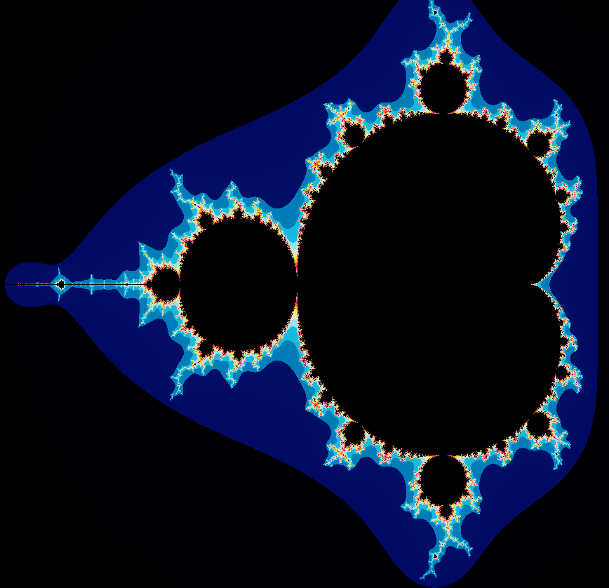

# Hi there, I'm Logan! 👋

I'm a student at 42 LeHavre, passionate about coding, and always eager to learn and explore new technologies. Currently, my main focus is on C and C++, with a sprinkle of Python.

## 🚀 Projects

One of my favorite projects is **Fractol**. I drew Mandelbrot and some of Julia's sets in C, using minilibx. Check out some snapshots of the mandelbrot fractal below:

  
  

Feel free to explore the full project on [GitHub](https://github.com/lolopss/fractol).

## 🔧 Skills

## 🌐 Connect with me

- Email: ldaniel@student.42lehavre.fr
- [LinkedIn](https://www.linkedin.com/in/logan-daniel-08b662259/)
- [42Profile](https://profile.intra.42.fr/users/ldaniel) 

## 👾 Interests

In my free time, you'll find me playing video games or getting active with sports, especially gym workouts and bouldering.

Feel free to reach out if you have any questions, or just chat about coding, fractals, games, or anything else!
